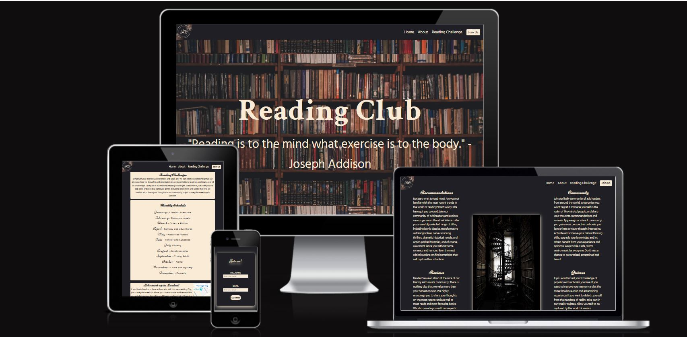
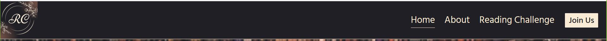
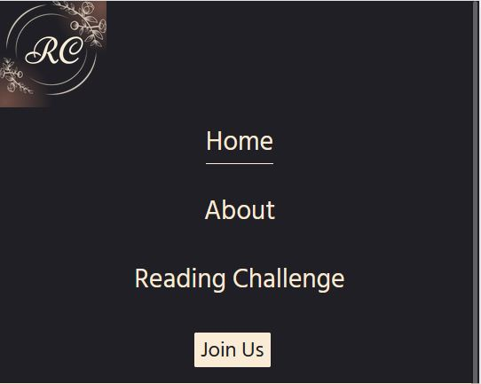
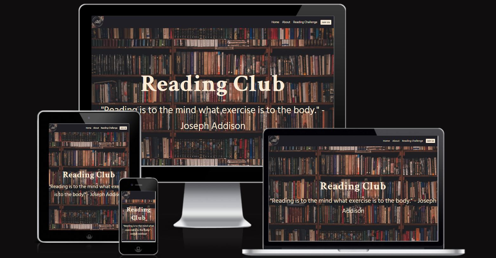
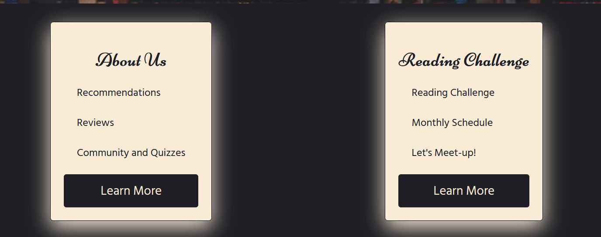
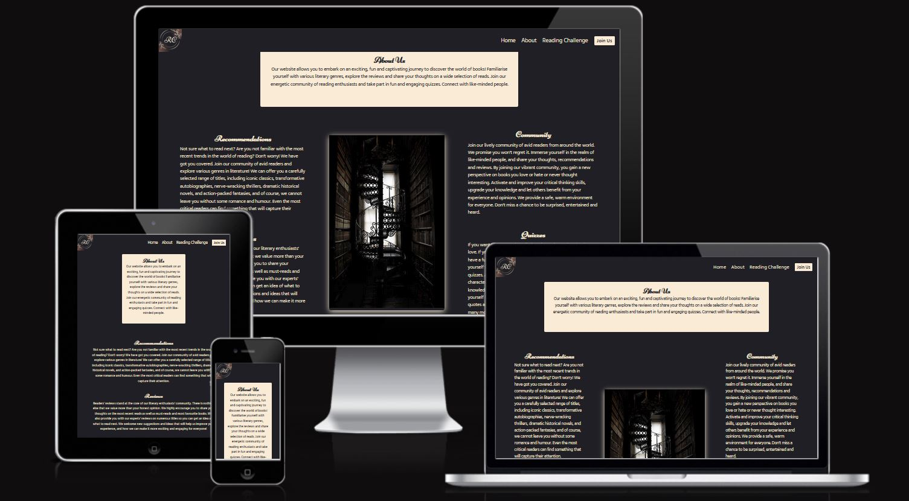
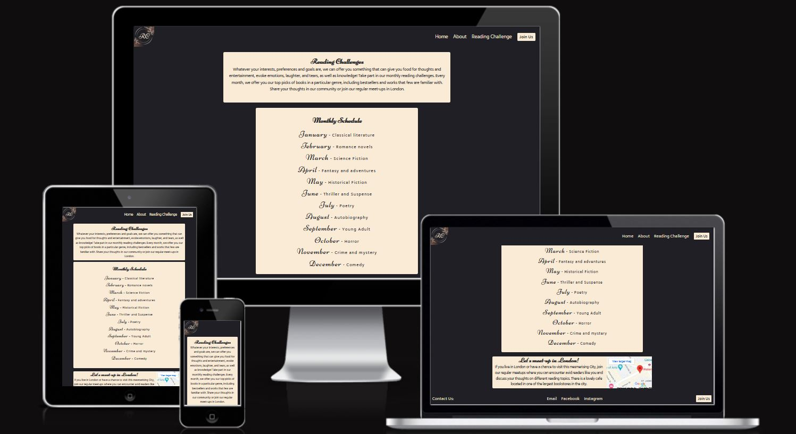
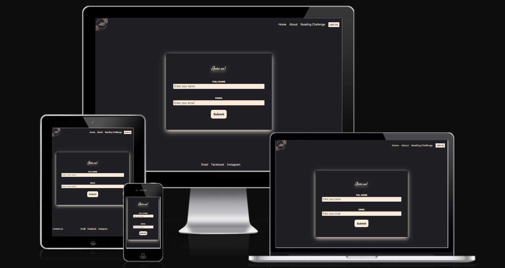

# Reading Club

Visit the deployed site: [Reading Club](https://github.com/KatVolkova/reading-club)

Reading Club is a website created to attract those interested in reading. The target audience for this site is avid readers who would like to expand their knowledge on numerous literary genres, express their thoughts by sharing reviews and participating in the readers' community, enjoy book quizzes and take part in reading challenges.

## Table of Contents
   
- [Reading Club](#reading-club)
  - [Table of Contents](#table-of-contents)
  - [Features](#features)
    - [Navigation bar](#navigation-bar)
    - [Hero Image](#hero-image)
    - [The summary section](#the-summary-section)
    - [Footer](#footer)
    - [About Us page](#about-us-page)
    - [Reading Challenge page](#reading-challenge-page)
    - [Join Us page](#join-us-page)
  - [Design](#design)
    - [Colour Scheme](#colour-scheme)
    - [Typography](#typography)
    - [Imagery](#imagery)
  - [Technologies Used](#technologies-used)
    - [Languages Used](#languages-used)
    - [Programs Used](#programs-used)
  - [Deployment](#deployment)
  - [Testing](#testing)
    - [Solved Bugs](#solved-bugs)
  - [Credits](#credits)

- - -

## Features

### Navigation bar

Each of four pages has a responsive navigation bar that consists of a Logo (used as a toggler for mobile phone screens, links to Home page, About Us page, Reading  Challenge page and Join Us  page.

### Hero Image

The hero section includes an image with Reading Club heading and  a quote that suits the idea of the site

### The summary section

The summary section provides a very brief introduction to what users  can expect from the website

### Footer

The footer section features social network links and  an email link as well join us  button to ensure that users have different means to keep track of the events promoted by the website

### About Us page

	About Us page provides users with events that participants can take part in. 
	About us section summarises the activities that are offered to users such as Book recommendations, readers community, readers reviews and quizzes
    Events section gives a more detailed description of each activity  and also includes an  image in the middle

### Reading Challenge page

	Reading challenge page introduces the idea of the reading challenges and explains the reasons for users to participate
	Value
	
	The Monthly schedule section provides a list of reading challenges for each month. There is a specific genre for each month
	Value
	
	The meet up point section is targeted  at those who live or visit London at the time of meet up, it also provides a map where the meet ups could be hosted for a small group of people

### Join Us page

	Join us page includes the simple sign up form for those who want to be a part of the readers community and benefit from the various events

## Design

### Colour Scheme

Colours used:

- background colour `#1f1f24`  
- font colour `#FAEBD7`

### Typography

Google fonts have been used for this website

* For the Page Title I have used the google font [Almendra](https://fonts.google.com/specimen/Almendra?preview.text=The%20Quiz%20Arms%20THE%20QUIZ%20ARMS&preview.text_type=custom&query=almendra).

* For the body of the page I have used the google font [Quicksand](https://fonts.google.com/specimen/Quicksand?preview.text=The%20Quiz%20Arms%20THE%20QUIZ%20ARMS&preview.text_type=custom&query=quicksand).

### Imagery

Pexels

## Technologies Used

### Languages Used

HTML, CSS

### Programs Used

- [Git](https://git-scm.com/) - For version control.

- [Github](https://github.com/) - To save and store the files for the website.

- [Google Fonts](https://fonts.google.com/) - To import the fonts used on the website.

- [Google Developer Tools](https://developers.google.com/web/tools) - To troubleshoot and test features, solve issues with responsiveness and styling.

- [Canva.com](https://canva.com/) To create and customise favicon and logo

- [Am I Responsive?](http://ami.responsivedesign.is/) To show the website image on a range of devices.

- [Shields.io](https://shields.io/) To add badges to the README

- [Webpage Spell-Check](https://chrome.google.com/webstore/detail/webpage-spell-check/mgdhaoimpabdhmacaclbbjddhngchjik/related) - a google chrome extension that allows you to spell check your webpage. Used to check the site and the readme for spelling errors.

- - -

## Deployment

The site is deployed using GitHub Pages - [Reading Club](https://github.com/KatVolkova/reading-club/).

To Deploy the site using GitHub Pages:

1. Login (or signup) to Github.
2. Go to the repository for this project, [KatVolkova/Reading-Club](https://github.com/KatVolkova/reading-club/).
3. Click the settings button.
4. Select pages in the left hand navigation menu.
5. From the source dropdown select main branch and press save.
6. The site has now been deployed, please note that this process may take a few minutes before the site goes live.

## Testing

### Solved Bugs
|
- - -
## Credits

